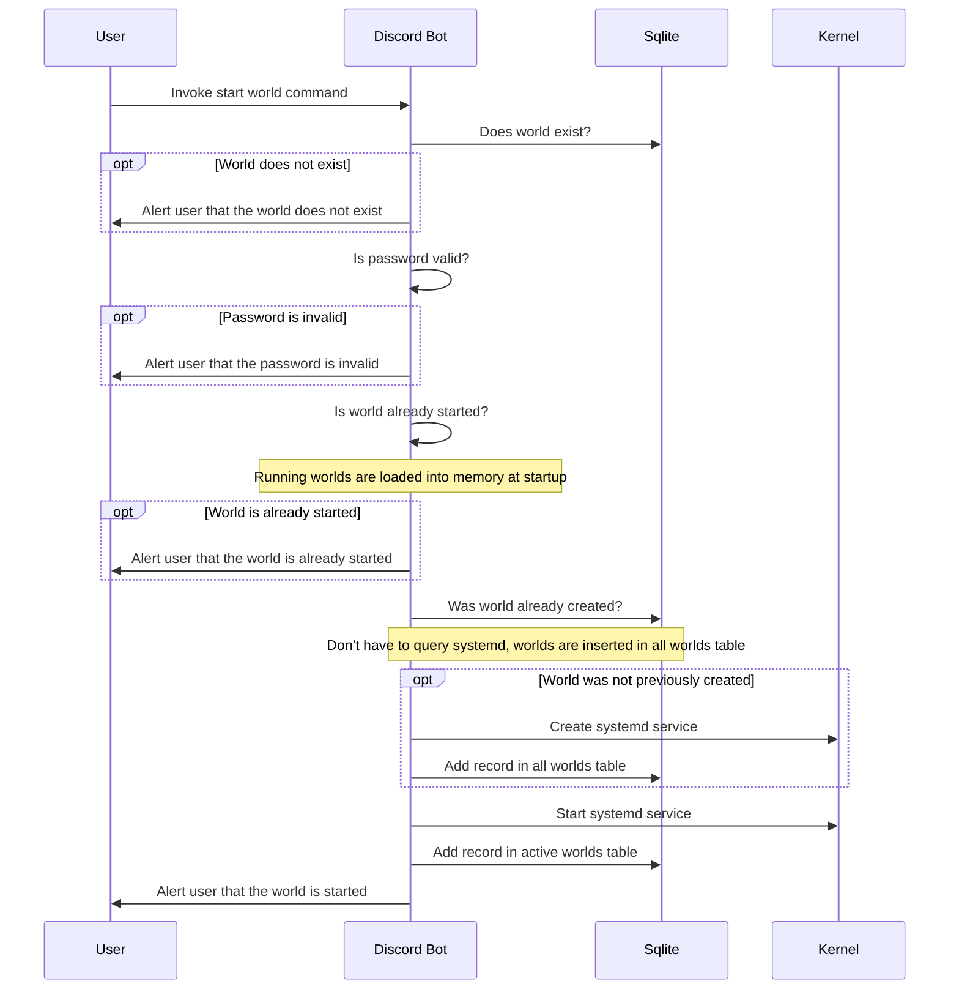

```mermaid
sequenceDiagram
    participant User
    participant Discord Bot
    participant Sqlite
    participant Kernel
    User->>Discord Bot:Invoke start world command
    Discord Bot->>Sqlite:Does world exist?
        opt World does not exist
        Discord Bot->>User:Alert user that the world does not exist
    end
    Discord Bot->>Discord Bot:Is password valid?
        opt Password is invalid
        Discord Bot->>User:Alert user that the password is invalid
    end
    Discord Bot->>Discord Bot:Is world already started?
    Note over Discord Bot:Running worlds are loaded into memory at startup
        opt World is already started
        Discord Bot->>User:Alert user that the world is already started
    end
    Discord Bot->>Sqlite:Was world already created?
    Note over Discord Bot,Sqlite:Don't have to query systemd, worlds are inserted in all worlds table
    opt World was not previously created
    Discord Bot->>Kernel:Create systemd service
    Discord Bot->>Sqlite:Add record in all worlds table
    end
    Discord Bot->>Kernel:Start systemd service
    Discord Bot->>Sqlite:Add record in active worlds table
    Discord Bot->>User:Alert user that the world is started
```