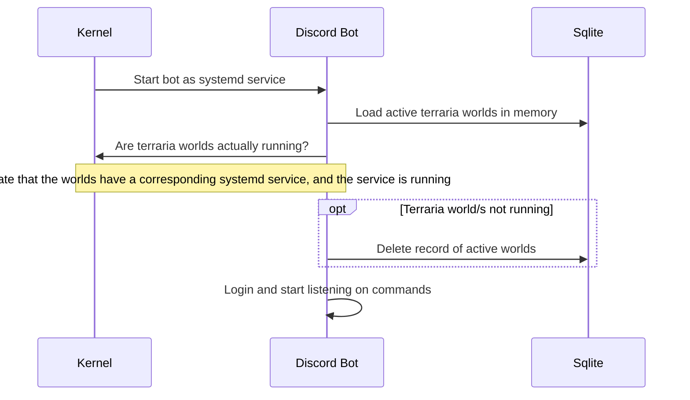

```mermaid
sequenceDiagram
    participant Kernel
    participant Discord Bot
    participant Sqlite
    Kernel->>Discord Bot:Start bot as systemd service
    Discord Bot->>Sqlite:Load active terraria worlds in memory
    Discord Bot->>Kernel:Are terraria worlds actually running?
    Note over Discord Bot, Kernel:Validate that the worlds have a corresponding systemd service, and the service is running
        opt Terraria world/s not running
        Discord Bot->>Sqlite:Delete record of active worlds
    end
    Discord Bot->>Discord Bot:Login and start listening on commands
```