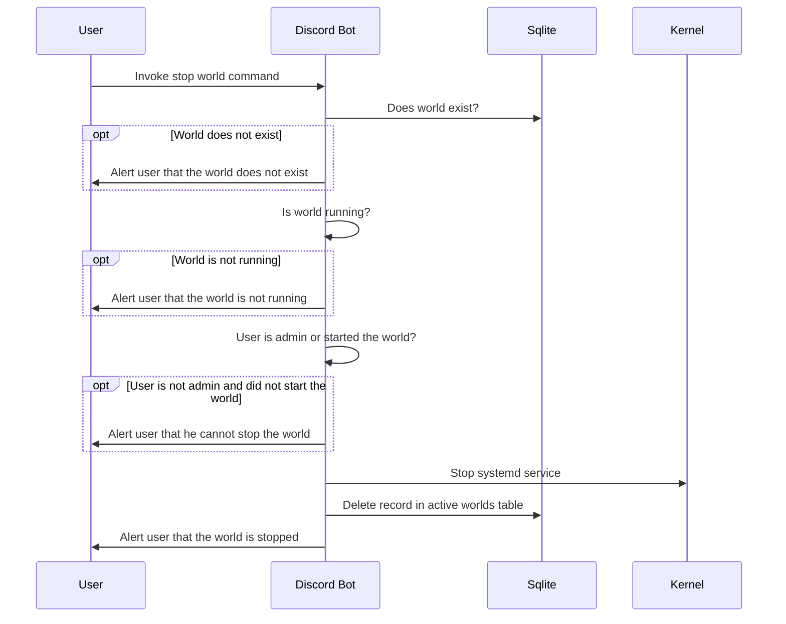

```mermaid
sequenceDiagram
    participant User
    participant Discord Bot
    participant Sqlite
    participant Kernel
    User->>Discord Bot:Invoke stop world command
    Discord Bot->>Sqlite:Does world exist?
        opt World does not exist
        Discord Bot->>User:Alert user that the world does not exist
    end
    Discord Bot->>Discord Bot:Is world running?
        opt World is not running
        Discord Bot->>User:Alert user that the world is not running
    end
    Discord Bot->>Discord Bot:User is admin or started the world?
        opt User is not admin and did not start the world
        Discord Bot->>User:Alert user that he cannot stop the world
    end
    Discord Bot->>Kernel:Stop systemd service
    Discord Bot->>Sqlite:Delete record in active worlds table
    Discord Bot->>User:Alert user that the world is stopped
```